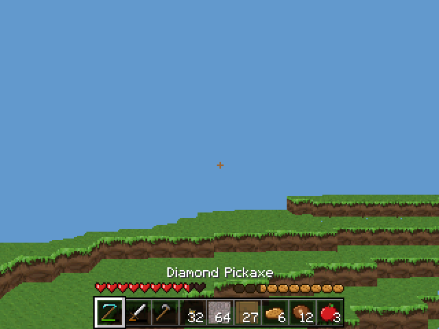
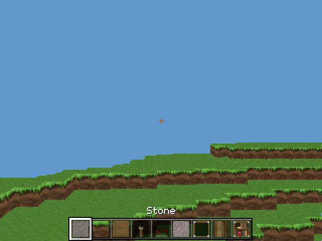
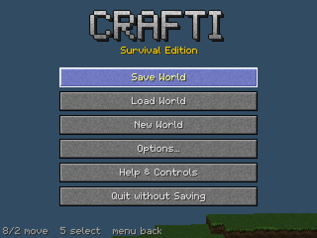
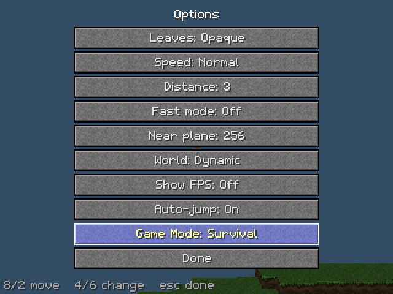
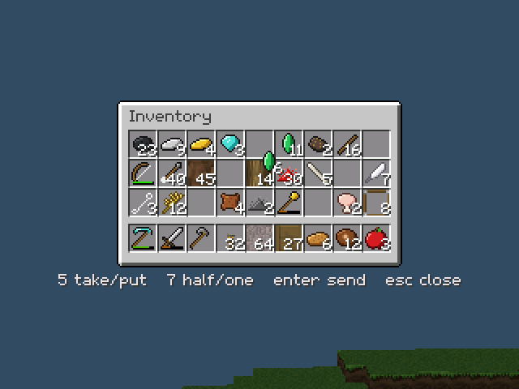
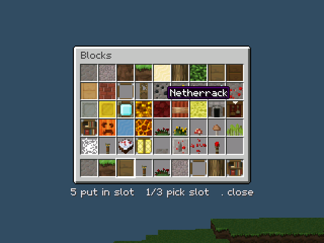
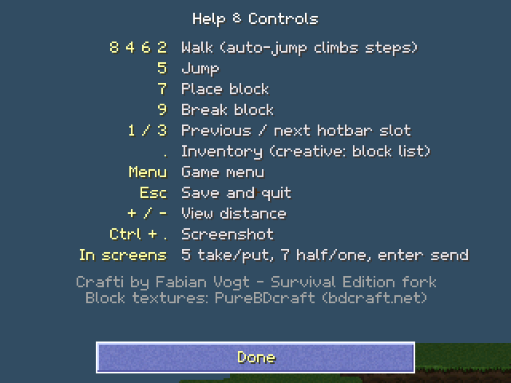

Crafti Survival Edition
=======================

A survival-mode fork of [crafti](https://github.com/Vogtinator/crafti) by Fabian Vogt: 3D Minecraft for TI-Nspire CX calculators running Ndless.
The goal is 1.8.8-style survival play (items, mining, mobs, and difficulty levels) on a calculator.

> **Status:** the foundation and the new Eaglercraft-style UI are done.
> Hold-to-mine, tool wear, block drops and mobs are next.
> Until mining arrives, breaking a block in survival puts it straight into your inventory.
> Every screenshot below is from the current build.

Screenshots
-----------

| | |
|---|---|
|  |  |
| Survival: hearts, hunger and the 9-slot hotbar | Creative: the same hotbar, without hearts and hunger |
|  |  |
| Game menu | Options, with Auto-jump and Game Mode |
|  |  |
| Survival inventory: 36 slots, counts and wear bars | Creative block list |
|  | |
| Help & Controls | |

All UI art is original: the pixel font, hearts, hunger, item icons and the title wordmark are drawn by scripts in `tools/` (previews in `tools/preview/`). Nothing is copied from Minecraft or Eaglercraft.

What's new so far
-----------------

- **Eaglercraft-style UI:**
  - a 9-slot hotbar with item counts and wear bars
  - hearts, hunger and air bubbles
  - an inventory screen
  - button menus and a pixel font with drop shadows
- **Items:** 53 items, each with its own icon: tools in six materials, food, ores and materials.
- **Game mode:** switch between Survival and Creative in Options (locked in Hardcore).
- **Game clock:** fixed 20 ticks per second, independent of frame rate.
- **Entities:** up to 32 entities with physics and collision.
- **Saves:** new save format (v7) with an automatic backup. An unreadable save is never overwritten, and old v6 worlds still load (in creative mode).
- **Lighting:** 8 brightness levels for the coming day/night cycle.
- **Auto-jump:** walks you up one-block steps.
- **Stress test:** `crafti-stress.tns` shows FPS and ticks per second on the calculator.

Planned
-------

- Hold-to-mine with tool tiers and durability, and block drops
- Zombies, creepers, skeletons, passive animals and a wandering trader
- More common emeralds, Ancient Debris near bedrock, and netherite tools
- Crafting, furnaces, chests and beds
- Difficulties: Peaceful, Easy, Normal, Hard and Torment, plus a Hardcore switch

Building
--------

See [docs/building.md](docs/building.md). GitHub Actions builds `crafti.tns` and `crafti-stress.tns` on every push (see the **Actions** tab).

Controls
--------

| Key | In the world | In screens |
|---|---|---|
| 8 4 6 2 | Walk (auto-jump climbs steps) | Move the cursor |
| 5 | Jump | Take or put down a stack |
| 7 | Place block | Take half, or put down one |
| 9 | Break block | |
| 1 / 3 | Previous / next hotbar slot | Pick the hotbar slot (block list) |
| . | Inventory (creative: block list) | Close |
| enter | | Send a stack to the other section |
| menu | Game menu | Back |
| esc | Save and quit | Close |
| + / - | View distance | |
| ctrl + . | Screenshot | |

Limitations
-----------

crafti doesn't use floats, so there will be some graphical inaccuracies.

Credits
-------

Original crafti by [Fabian Vogt (Vogtinator)](https://github.com/Vogtinator/crafti); ticalc.org Program of the Year 2014.
Block textures from PureBDcraft by https://bdcraft.net.
